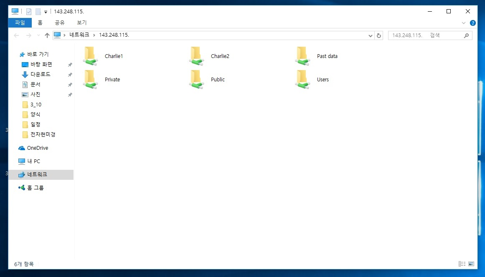
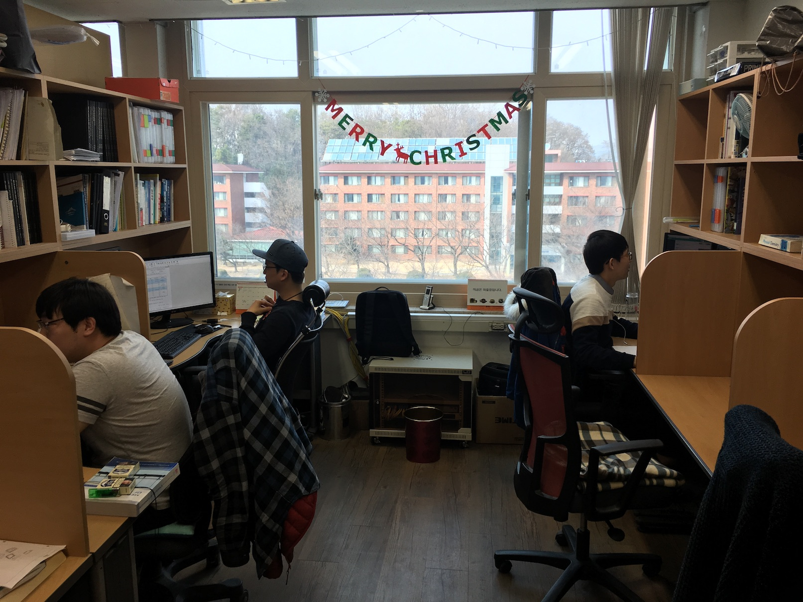
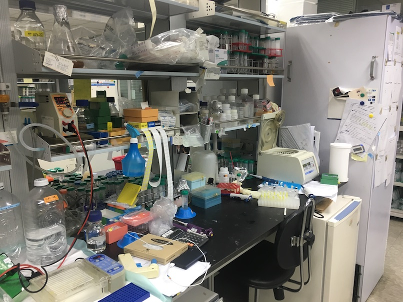
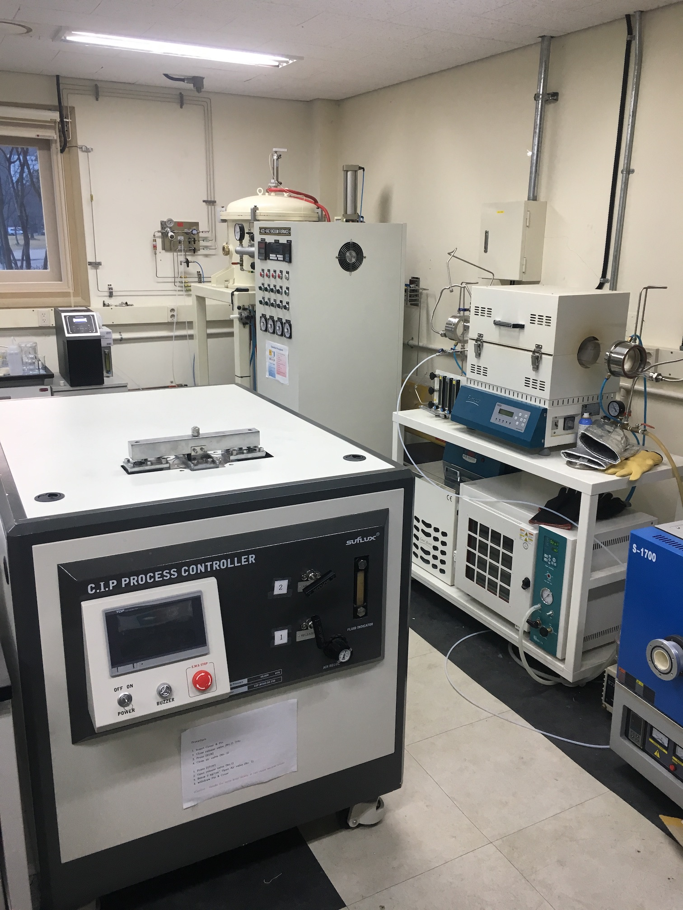
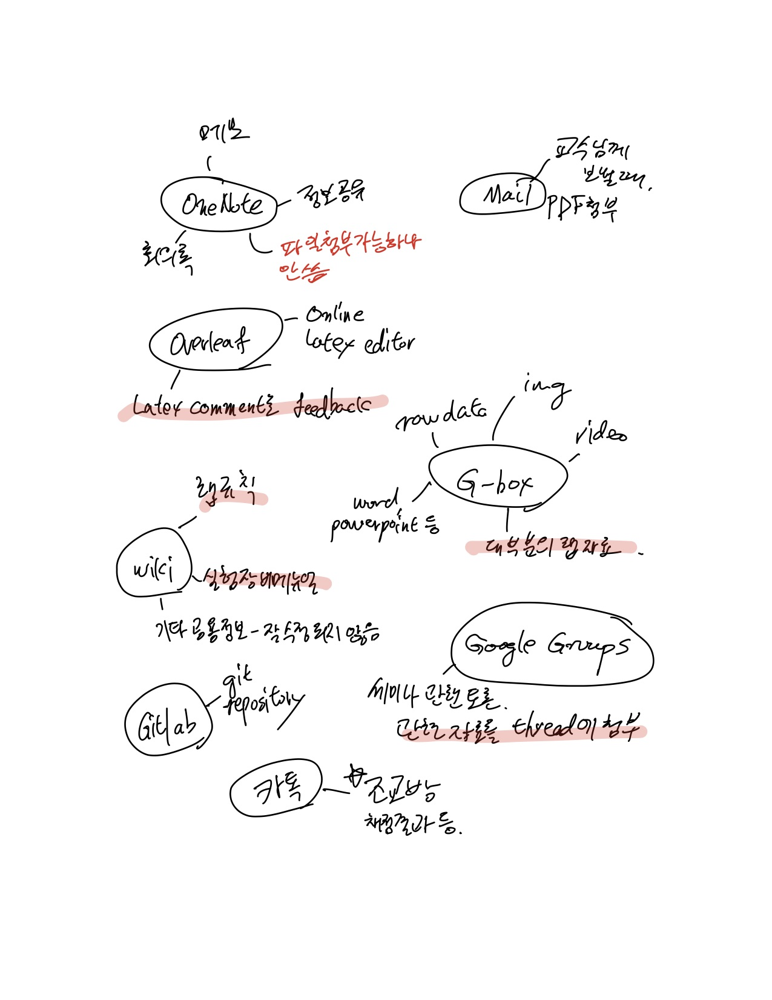
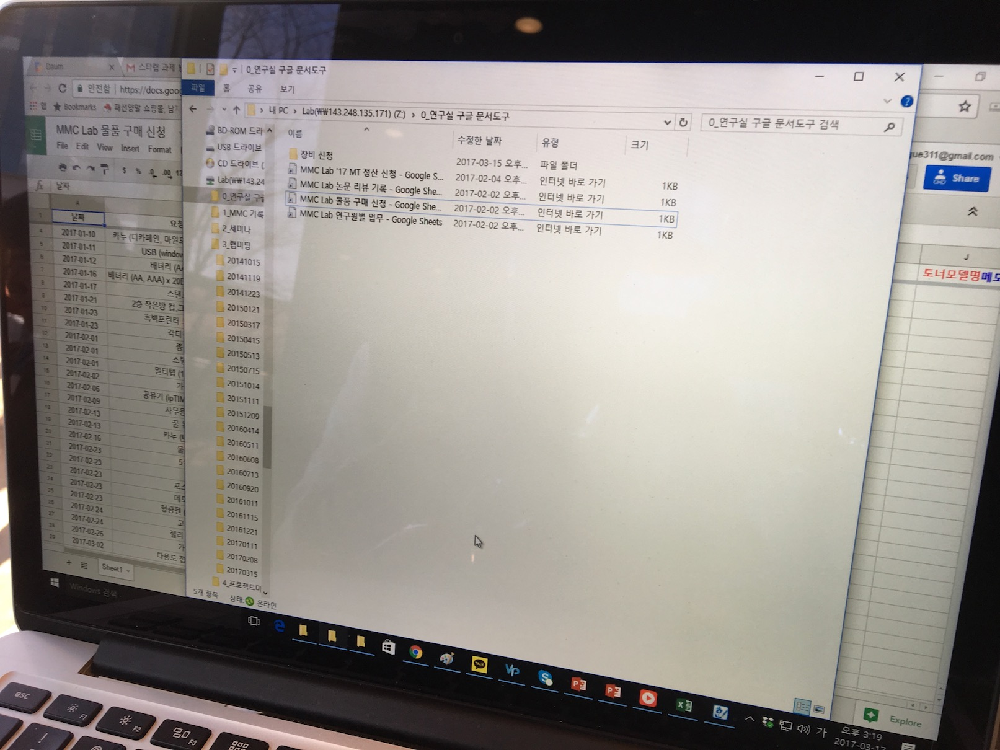

# Design Project 1: Needfinding

## Experience 
Redesigning the experience of sharing documents by graduate students.

## Observations & Interviews

We wanted to hear about the sharing experiences of various graduate students.
So, We interviewed 7 graduate students with all different majors, face to face.

What we asked to people was as follows.
``` 
1. When, where, and how do you share documents?
2. Why you use that method or channels for sharing?
```

### Interview1 
- Interviewer: Seungmin Lee
- Interviewee: M.S. student in Department of Materials Science and Engineering
- Observations: Rare use of computers especially on experiments. Only use computers for writing thesis, making posters or PPTs. Share documents and communicate about it by off-line.
- Interesting moments: Use network folder for archiving and sharing documents, but do not co-work with the archived document. Only finished documents are archived.
- Breakdowns: NEVER USE document sharing tools such as google drive, dropbox. And DO NOT see the necessity to introduce any document sharing tools.
- Photo or Sketch: 

In the interviewee's lab, they use network folder to archive documents and files.

### Interview2
- Interviewer: Seungmin Lee
- Interviewee: M.S. student in Department of Mechanical Engineering
- Observations: Interviewee E-mails to professor with attaching a document, then professor replies to decide off-line meeting appointment. Interviewee communicates with his professor almost by off-line.
- Interesting moments: He said that most of the laboratories might not need document sharing tools. From morning to evening, all the lab members stay and work together in the lab, so they prefer and think it's efficient to share the document and communicate by off-line.
- Breakdowns: NEVER USE document sharing tools such as google drive, dropbox. And DO NOT see the necessity to introduce any document sharing tools.
- Photo or Sketch: 

Lab members stay and work together in the lab all day long.

### Interview3
- Interviewer: Seongwon Lee
- Interviewee: M.S. student in Department of Civil and Environmental Engineering. She works in tiny lab.
- Observations: Interviewee shared documents rarely. Actually she don't have to share her documents with her team mates in real time with others, so her sharing experience is closer to submission than sharing. She used only mail for sharing documents. her lab mates use Kakaotalk for sharing a file, but they also only use mail and Kakaotalk. Do not use other methods never. 
- Interesting moments:
    1. Because they share many documents with mail, they set the mail sending format of some documents. 
    2. When she and her teammates send documents to their advisor, they only use mail. They never use Kakaotalk for public affairs.
- Breakdowns: Sometimes she forget to attach a file to an email. And she showed me some mail which she sent a mail without attachment.
- Photo:


 | 
:---:|:---:
She forgot to attach file|Mail's detail


### Interview4
- Interviewer: Rohjoon 
- Interviewee: She is Ph.D student in Department of Biology. She runs a protein synthesis experiment. The interview was done on the first floor of building where her laboratory is in. 
- Observations: 
She rarely shares documents, except for making an annual report or a conference presentation. When writing a paper, she shares documents only with her professor. The professor prefers old method especially email, and she follows that. She usually do her experiment alone, and there is no case sharing the experiment data before it is finished. Even for a joint research, only the result paper / documents are shared, not the intermediate data. In case of sharing simple data / document / image to other researcher or co-worker, she use Kakaotalk messenger.

- Interesting moments and Breakdowns: 
As the computer is rarely used during the experiment, the data is shared through research notes by showing it. For a joint research, there is no shared document of their work so that it is hard to follow the progress of each work. 

- Photo or Sketch: 

Photo of the lab. Every researcher has their own table, and there is no computer on the table as it is useless. 


### Interview5
- Interviewer: Rohjoon 
- Interviewee: He is Ph.D student in Department of Quantum Engineering, conducting research on the material reaction. The interview took place in the laboratory building. 
- Observations: 
He usually shares presentation document, weekly report, assignment planning paper, and budget document. As he do his research alone, the data related to the research is not shared anyone excluding the professor. When sharing the document, he use email to the professor, and Kakaotalk to co-worker and other researcher on his lab.  

- Interesting moments and Breakdowns: 
The laboratory uses Google drive and Band by Naver, to archive documents, lead by the Professor. Basically, documents consist of presentation, and the archived data are used only for displaying the information to other people, not used within the lab.

- Photo or Sketch: 

The photo of the instruments in Quantum Engineering laboratory. The research is done individually. If instruments don’t support saving digital data, researcher never have to use the computer during the experiment. 


### Interview6
- Interviewer: Changje Jeong
- Interviewee: Ph.D student in KAIST School of Computing Human Computer Interaction Lab.
- Observations and Iterviews:
The interviewee shares document very often via various ways. He has 8 channels to share files between his lab colleagues and TAs. The main channel is OneNote. Each channel has its own type of documents.

> Breakdowns are styled with bold texts.

He's using Microsoft OneNote for text-sharing. It is the main sharing channel in his lab. It has minutes and notes. **Although it supports file upload, he's not using it** because download/upload are slow and it's hard to search a file since a file should be embedded in a note. The file list is not supported in OneNote. He also argued **each notes has different format and title** because there isn't standard rule and **it's hard to reformat each documents later**.

When he needs to report documents (mainly PDFs) to Professor, he's using E-Mail. 

A Overleaf is a service which supports Latex online editing and sharing. He is using Latex for his thesis and sharing it on Overleaf with professor. **He receives feedback comments as Latex comments.**

A G-Box is a NAS(Network Attached Storage) and it serves as Shared Storage between lab colleagues. Because it's shared file system, there are many kinds of **uncategorized files, e.g. PDF, word, raw experiment data files, images and videos.**

Wiki contains manuals of devices and rules of the lab.

They are using Google Groups for sharing contexts of lab seminars. The files which is related to lab seminars shared in Google Groups as attachments. **He said it's hard to find files in Google Groups because it's rarely used and it's hidden in conversation threads.**

For sharing codes, they use [Gitlab](https://gitlab.com).

The last one is KakaoTalk. He uses it to share a file to the TA group talk.



### Interview7
- Interviewer: Changje Jeong
- Interviewee: Ph.D student in KAIST Gradudate School of Information Security Multimedia Computing lab.
- Observations: The interviewee shares documents mainly on NAS. He also uses Google Drive but not often because of HWP file which is not supported on Google Drive to edit. Because his professor is preparing retirement, his lab is not trying to adopt new ways of sharing files.
- Interesting moments:
1. Manage google docs on NAS by link file because Google Drive's shared documents are hard to organize.

2. Hard to use Google Docs because of HWP files. They are using HWP because national research proposals should use HWP.
3. When outside, he asks others in lab to send file on NAS via Kakaotalk because NAS doesn't support mobile.
- Breakdowns: 
    - Cannot open file on NAS simultaneously if someone is opening the file. 

## Needs
- It is necessary for multiple people to see the shared document at the same time. 
- It is necessary to unify the format of the shared document. 
- It is necessary to unify the rules for organizing shared documents.
- It is necessary to manage the shared document like a file on their computer without a separate program
- It is necessary to quickly find the desired document in shared ones
- It is necessary for them to look up a document on the mobile.
- It is necessary to manage the documents received via e-mail.
- When working together, it is necessary to share the progress of the work.
- For efficient management of information, it is necessary to hide documents that are not to be seen in the future
- It is necessary to easily share existing documents with new people who come into the lab.

## Insights
- Documents created in one way are difficult to share in other ways. 
- Most people share only the information they need rather than share all the information.
- Use different tools for different sharing purpose.
- Use different sharing channels for different sharing user.
- MANY files are sharing with mail than expected.
- Document sharing channel is more than one.  (At least, Kakaotalk and mail)
- Sharing way of simple information and organized documents are different.
- If professor do not feel uncomfortable, there won’t any improvements, EVER.
- If they do not start document sharing from the beginning, it is almost impossible to organize the documents created before they start sharing documents.
- Needs about sharing way are totally different, as lab’s character different.
- Sharing way can be largely divided into sharing for the progress of work and sharing for archiving.

## Studio Reflections
- Some students was confused because some sentences in `Insights` section were not concrete, so we changed them. 
- TA said that everything was clear, from the target user to needs of them. But he was concerned about developing a solution program. He suggested to utilize GoogleDrive as a base program of the solution. But right now, we should focus on the `needfinding` parts, so we will consider the feedback later when we design the concrete solution.

