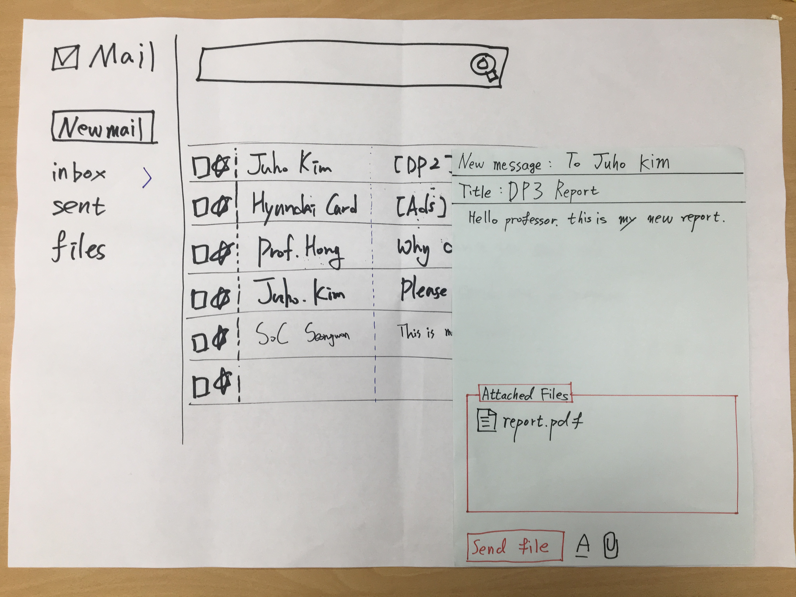
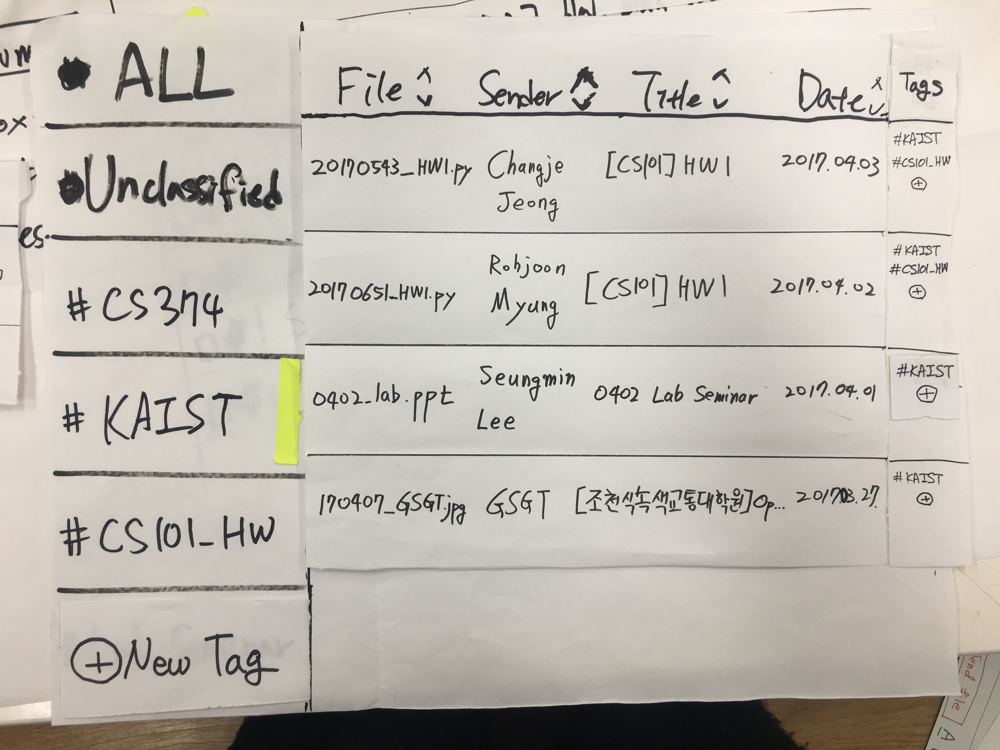
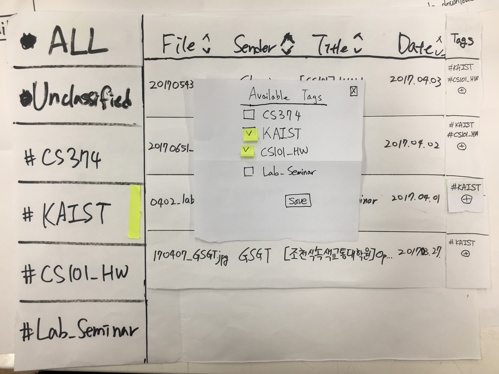

# CS374 - DP3
### Team NanoMario

## Photos of prototype

This is the initial view of our prototype.
 

Default mail send editor with yellow background color which appears when a user clicks `New Mail` button.

Mail send editor when a file is attached. The background color is changed to blue and `Send` button is changed to `Send file` with red color.

A view of attachment files which is filtered by tag #KAIST. When a user click `New Tag` button at left down corner, he/she can add a new tag.

The popup shows when a user clicks `+` button in tags column to attach/detach tags from the file.

## Briefing
We want to give a better way to manage attachments to people who share files with e-mail.
Our solution is for people to reduce mistakes in sending emails without attachments, and to manage attachments easier with tagging.

## Tasks
1. Write a new mail to Prof. Juho Kim, attaching a report file. 
2. Find a list view of attached files, and check all attachments, and filter CS101_HW related file only.
3. Add a new tag named ‘Lab-Seminar’, and apply it to the ‘0402_lab.ppt’ file.

## Participant
* SoC Senior / Male / use gmail client
* 16’ EE Student / Female / use KAIST mail client
* 14’ SoC Student / Male / use gmail client
* 11' SoC Student / Male / use gmail client

## Observations
### 1. Write a new mail to Prof. Juho Kim, attaching a report file.
* [High] They didn’t recognize changing background color of mail client. People does not notice weather changing the color of paper is intended or not because of paper prototype. 
  * We think it's due to limitation of paper prototype. We are going to test it on Mid-fi prototype.
* [High] Most users didn't understand why it is related to `reducing mistakes in sending emails without attachments`.
  * Our paper prototype might be work only if a user learned our features, changing color of background and a send button, and familiar with them. So we're going to consider a new task to test `reducing mistake ...` problem properly on low-fi prototype.  
* [Mid] Hard to distinguish `send` button and  `send file` button.
  * Change color of button background not text color and test it on Low-fi prototype.

### 2. Find a list view of attached files, check all attachments, and filter CS101_HW related file only.
* [High] The user who cannot intuitively understand our new feature, doesn’t have a proper mind model. She hesitates how and what to do. After facilitator explained more, she understands our ideas and reacts as our intention.
  * Provide a simple tutorial about new feature on the first time and test it on Mid-fi prototype.
* [Mid] The reactions was different between who can and cannot intuitively understand the new feature “files list”.
  * Provide more detailed briefing and task descriptions to testers.
* [Mid] Some people was confused becuase he/she didn't recognize '#CS101_HW' was already exist. 
  * Sort tags as alphanumeric order in tag lists for user to easily find it in Low-fi prototype.
* [Low] A user without hashtag concept, understands it as directory because of layout.
  * We think that a user could understand the concept even if he/she adds thier own tag at once. So we're going to test weather user understatnd the `tag` concept properly using our system on mid-fi or hi-fi prototype. 

### 3. Add a new tag named ‘Lab-Seminar’, and apply it to the ‘0402_lab.ppt’ file.
* [High] Because colors didn't exist between elements, a user couldn't recognize which is a button or a text.
  * On low-fi prototype, we're going to add some colors on buttons, and other elements.
* [Mid] Because `Add new tag` button is at the bottom of tag list, it took long time to find it.
  * On low-fi prototype, `Add new tag` button will be on the top of the list or proper position after doing a simple survey on target users. 
* [Low] Needs searching tag feature. He was confused because there wasn't searching feature on tag lists.
  * It will be added on mid-fi prototype. Before that, we should consider about a proper position of a search bar and it will be added on low-fi prototype. 
  

## Individual Reflections
### Rohjoon Myung (20090336)

#### What role did you play in each round?
Facilitator, Observer

#### What were some of the difficulties you faced playing the role(s)?
Sometimes, people didn’t understand about the task or the question. I had explained about confused one, and lead the test, but I was wonder I was good or not. After reading the reading-material of user testing, I’d reviewed what I was doing, and found that it was a bit hard for me to telling interviewer saying what they’re thinking and what they are going to do.  

#### In what way was paper prototyping useful in your project?
We could consider about the real UI interface in advance. And we could check the feasibility of it by experiecing it.  

#### What did your paper prototype not cover or test?
One of problems our solution should handle is `a mail with missing attachment`.  We’re trying to reduce an error of sending email without attachment, and made some solutions. But as one of the best solution detects error situation through a body of the email, it might be hard to test it through paper prototype. So, we’re going to test it on mid-fi prototype or hi-fi prototype. 

### Chang-je (id)

### sungwon (id)

### seung min  (id)
// I don't care about the exact spelling of your name. please correct it and write down the refection . =) 

## Studio Reflections
1. (Students) `Tagging a file` is really good feature. But sometimes, a user might want to filter files of #CS_HW1 or all of #HW. How did you distinguish files like that? 
 There will be a parent group and child group, which could be devided by `/`. In this case, if the file should have a tag `#HW/CS_HW1`, then you could filter them as you want. 
 
 2. (TA) There should be a more active feedback to user like toasting a notice popup for an error of missing an attachment by analyzing a title or a body of the email weather it should contain an attachment or not.
  It's really good point. We're going to apply the 'active' feedback on mid-fi prototype as there might be some automated funtionality.  

