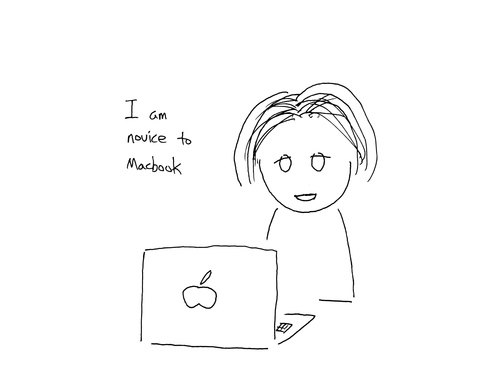
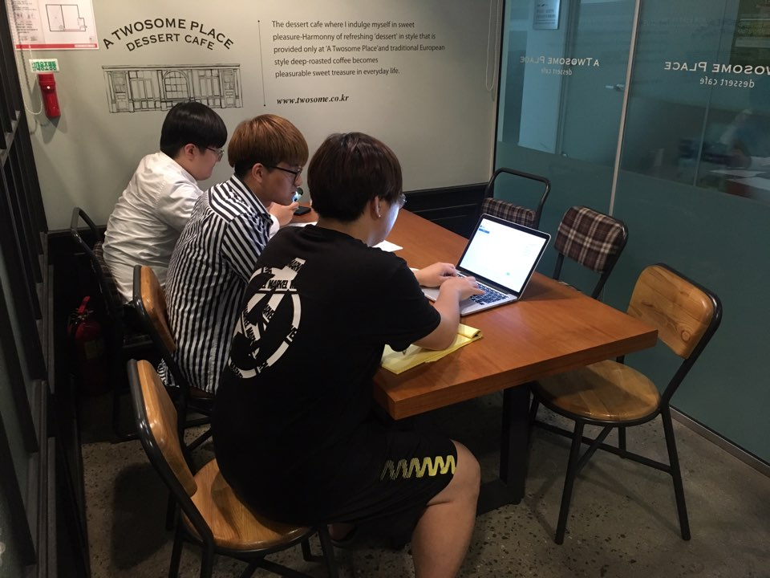

# CS374 DP7 - Team NanoMario

# Planning: Written protocol
## Instructions for preparation and setting up the testing environment
Valid website URL: https://cs374-32b99.firebaseapp.com

Team should prepare:
- The MacBook Pro (Retina, 13-inch, Mid 2014)
- Camera or smartphone to take a picture.
- Team should open website with chrome before starting a test.

## Introduction and informed consent
### Introduction
  We want to give a better way to manage attachments to people who share files with e-mail. Especially, this service is for graduate students who have to send/receive mail with attachment. They have some difficulties in handling many mail’s attachment at once. So we are going to give a solution which can help to reduce mistakes in sending emails without attachments, and manage attachments easier with tagging.
  When you start test, you can login with mail what you use in first page. But it is not a mail system that really works, so it won’t show mail what you sent in real mail system, or really send mail even you click ‘Send Mail’ button on our system. So, feel free to use our system. When you login our system, you can see three components on our left sidebar.
 
### Informed consent
  1.  We are going to record the video of the computer screen and the audio using computer mic while you are using our service.
  2. We might take pictures at the back of you while using our service, but it WILL NOT INCLUDE any personal information of you.
  3. We are going to give some questions during and after the testing and we’ll write down the answers.
  4. Keep in mind that we’re testing the computer system. We’re not testing you.
  5. The system is likely to have problems in it that make it hard to use. We need your help to find those problems.
  6. Your test results will be completely confidential.
  7. You can stop the test and leave at any time.
  8. you should ask “Do you have any questions I can answer before we begin?” Try to answer any questions the user has. 

## Tutorial or training
  > Because our system is similar with existing mail system, we may not need a tutorial. But if a user don’t understand what is going on, then we are going to explain the system detail less than 1 minute.

  There are 3 tabs on left side bar, `inbox`, `sent`, and `files`. On the `inbox` tab, you could see all mails you had received. On the `sent` tab, you could see mails you had sent. And on the `files` tab, you could see all the attachments which are sent or received. 

## Task list & instruction:
  > We don’t need instruction because our system is similar with existing mail system, and we already give sufficient information about how to use our system on tutorial part.

  1. Try to send email to Prof. Juho Kim(juhokim@kaist.ac.kr) without attachment. Please include words such as '첨부', 'attach', or 'attachment' in mail body. 
  2. After trying without attachment, try it again with attachment.
  3. Find a menu for exploring attachments. Check all attachments, and find CS101_HW1 related attachments only.
  4. Add a new tag named ‘Lab Seminar’, and apply it to the file that you have sent on the first task. 
  5. Feel free to use. Do whatever you want.

## Recording strategy
  We’re going to record the whole screen by Mac’s `QuickTime Player`, which could record the screen and the voice at the same time. 

## Questionnaires, Interview questions
  1. What do you think of the error message when an attachment is not on the mail sending a mail.
  2. What do you think of ‘clip’ icon? What reminds you? Do you recognize it? 
  3. Was there any unnatural or unusual features?

## Debrief prompt:
  First, we should give a participant a great thank with smile.
  Our project is to help graduate students deal with attachments more efficiently, one of the grievances of using email.
  Thanks to you, I think we can improve our system in a better way.
  Thank you for your precious time. (Finishing greetings, freely)

# Session observations
  > We took pictures of each participant on their back when they are experiencing our system. However as we didn’t make any protocol to take a picture except for taking him/her on their back, the quality of the picture is extremely not consistent. Please understand.

## P1
### Participant information
  

* Who? 
  - Graduate school student of Civil & Environmental Engineering Department
  - Mainly using KAIST Mail
  - Never have TA experience

* How did you recruit?
  - Friend of Seongwon Lee
* Why does she represent target users? 
  - Because she is a graduate student.

### Summary of session
  // TODO
  
## P2
### Participant information
  

* Who? 
  - Graduate school student of Mechanical Engineering Department
  - Mainly using Gmail. Forwarding KAIST Mail to Gmail.
  - Never have TA experience

* How did you recruit?
  - Friend of SeungMin Lee
* Why does he she represent target users? 
  - Because he is a graduate student.

### Summary of session
  // TODO

## P3
### Participant information
  

* Who? 
  - Graduate school student of Materials Science and Engineering Department
  - Mainly using KAIST Mail
  - Never have TA experience

* How did you recruit?
  - Friend of SeungMin Lee
* Why does he represent target users? 
  - Because he is a graduate student.

### Summary of session
  // TODO

## P4
### Participant information
  

* Who? 
  - Graduate school student of Electrical Engineering Department
  - Mainly using GMail
  - Never have TA experience

* How did you recruit?
  - Friend of Seongwon Lee
* Why does he represent target users? 
  - Because he is a graduate student.

### Summary of session
  // TODO

## P5
### Participant information
  

* Who? 
  - Graduate school student of Computer Science Department
  - Ph.D candidate at [KAIST HCI Lab](http://hcil.kaist.ac.kr/)
  - Mainly using GMail
  - He has many TA experiences. He is currently working as CS206 Data Structure TA.

* How did you recruit?
  - Friend of Changje Jeong, Rohjoon Myung 
* Why does he represent target users? 
  - Because he is a graduate student.

### Summary of session
  // TODO

# Studio Reflections

> Asking about privacy was good. it should be reflected to all user test, too.

We stated our informed consent to every participants, and we carefully considered their privacy and other human rights.

> Task includes research about how to manage files, but there is no questions about it.

> Will your team use think aloud strategy?

We recorded sound but it was not for think aloud strategy but for understanding context of recorded screen. So we didn't use it.